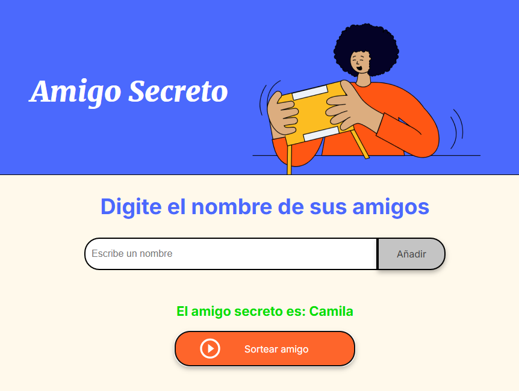
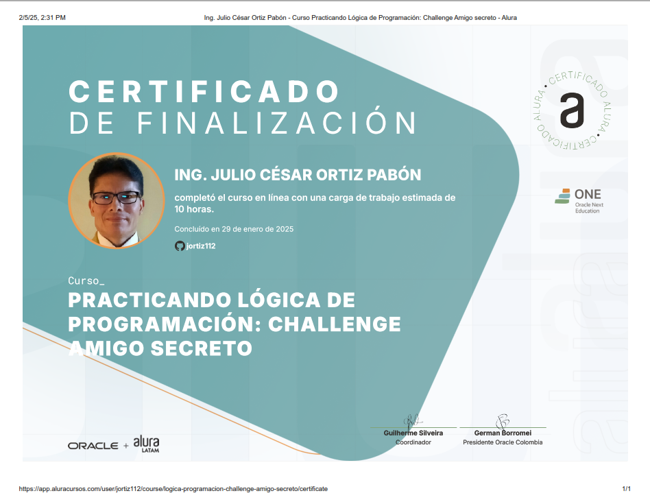

# <h1 align="center"> Challenge Amigo Secreto </h1>



## Descripción del proyecto

```sh

El Challenge Amigo Secreto es un proyecto de aprendizaje basado en desafíos que forma parte del curso
de Lógica de Programación de Alura Latam. En este challenge, los estudiantes tendrán que crear un
programa que simule un sorteo de amigo secreto.

```

## Objetivos de aprendizaje

```sh

- Practicar la lógica de programación y la resolución de problemas.
- Aprender a estructurar y organizar un proyecto.
- Desarrollar habilidades de trabajo en equipo y comunicación.
- Aplicar conceptos vistos en los cursos de Alura Latam, como variables, condicionales, ciclos,
  funciones, listas o arrays etc.

```

## Recursos y herramientas utilizados

```sh

- Trello: para organizar las tareas y el progreso del proyecto.
- Discord: para comunicarse con los compañeros y aclarar dudas.
- Cursos y formaciones de Alura Latam: para consultar contenidos relevantes y obtener más información.
- GitHub: para publicar y compartir el código del proyecto.
- LinkedIn: para conectarse con la comunidad y mostrar el aprendizaje adquirido.

```

## Pasos a seguir

```sh

- Familiarízame con el concepto de Challenge Based Learning y los 3 pilares: compromiso, investigación
  y acción.
- Revisar los materiales y recursos disponibles en Trello y Discord.
- Planificar y organizar el proyecto utilizando Trello.
- Investigar y consultar los cursos y formaciones de Alura Latam para resolver el desafío.
- Escribir el código y publicar el proyecto en GitHub.
- Compartir el aprendizaje y experiencia en LinkedIn.

```
## Características

- Generación aleatoria de números secretos.

- Interfaz simple y fácil de usar.

## Tecnologías Utilizadas

- HTML

- CSS

- JavaScript

## Funcionalidad del Amigo Secreto

```sh

1. Escribe un nombre en la casilla de texto y dar click en el botón añadir, no se permitirá
   ingresar nulos.
2. Ingresar todos los nombres de sus amigos que desee.
3. Una vez que se tenga la lista de amigos ingresada, se puede proceder a sortear el amigo
   secreto dando click el botón Sortear amigo.
4. Se puede seguir incrementando nombres a la lista.

```

## Instalación

```sh
Para probar la funcionalidad del "Amigo Secreto", simplemente visita el siguiente enlace: 

```
### [Link a la página para probar el Amigo Secreto (https://jortiz112.github.io/challenge-amigo-secreto-julio/)](https://jortiz112.github.io/challenge-amigo-secreto-julio/)

## Contribuciones

>> Si deseas contribuir al proyecto, siéntete libre de hacer un fork del repositorio y enviar un pull request con tus mejoras o sugerencias.

## Autores del Proyecto

>>     Programación JavaScript               

                               
>>   Programación HTML y CSS

## Insignias ganadas

>>     Primera insignia ganada

## Certificado




